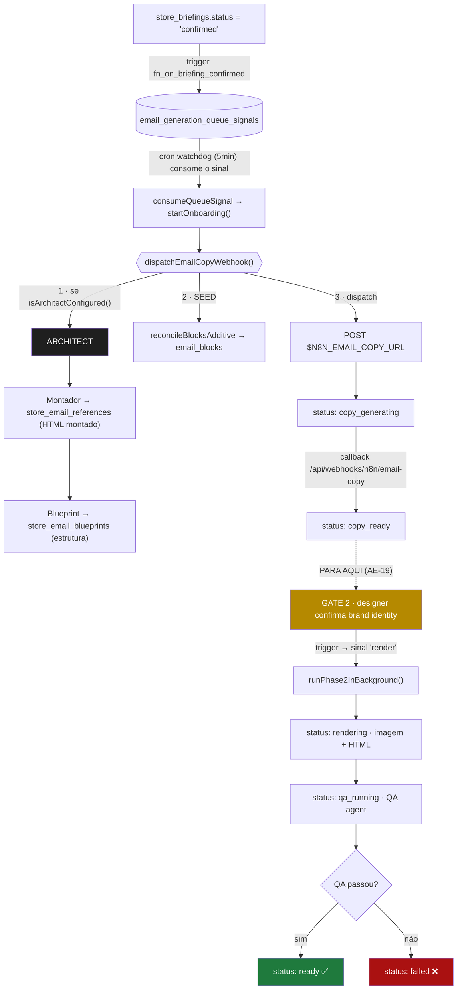
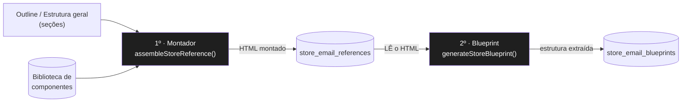
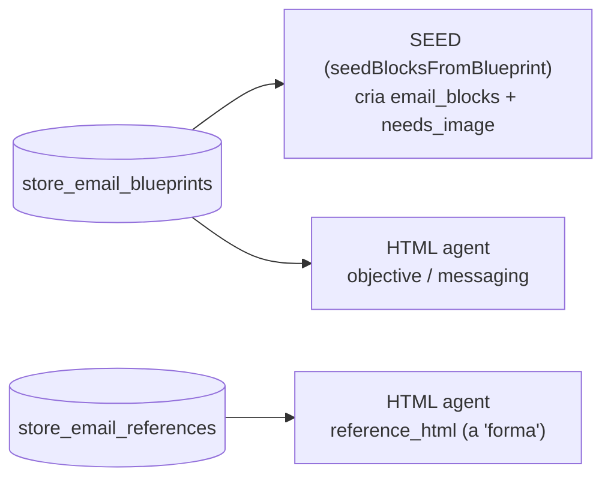
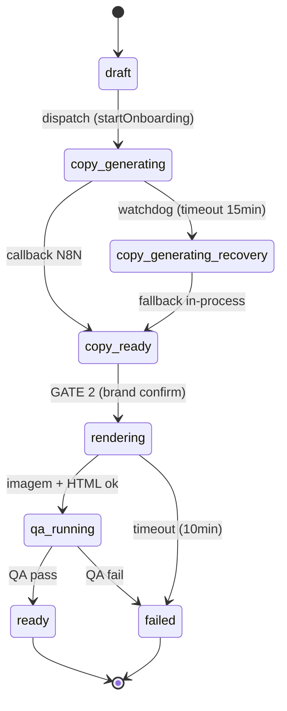
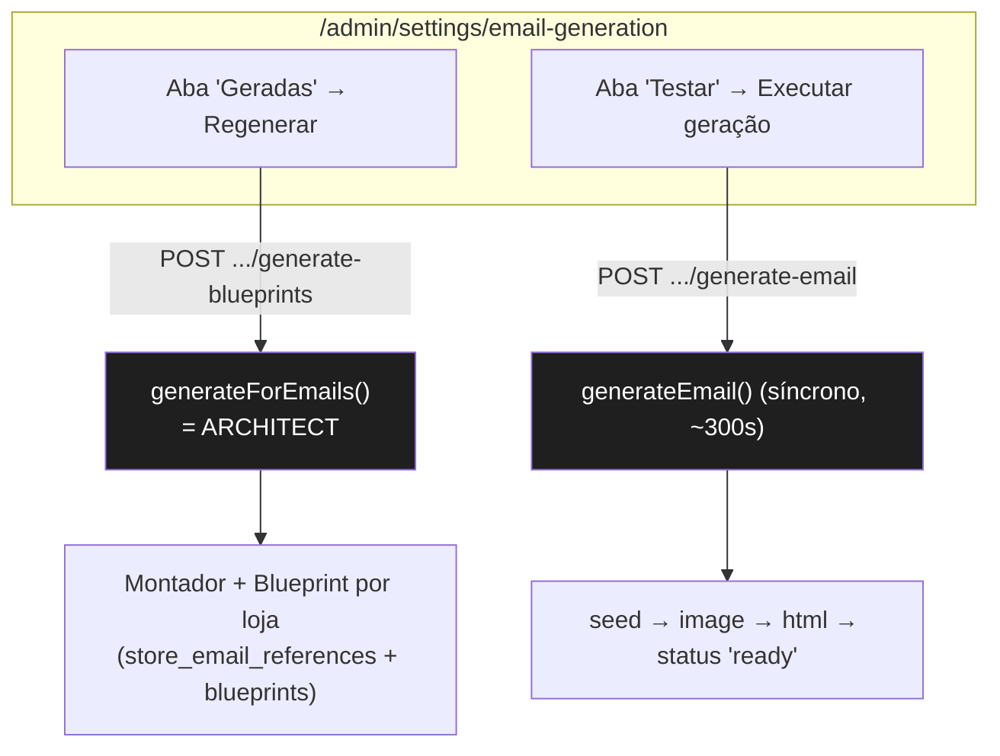
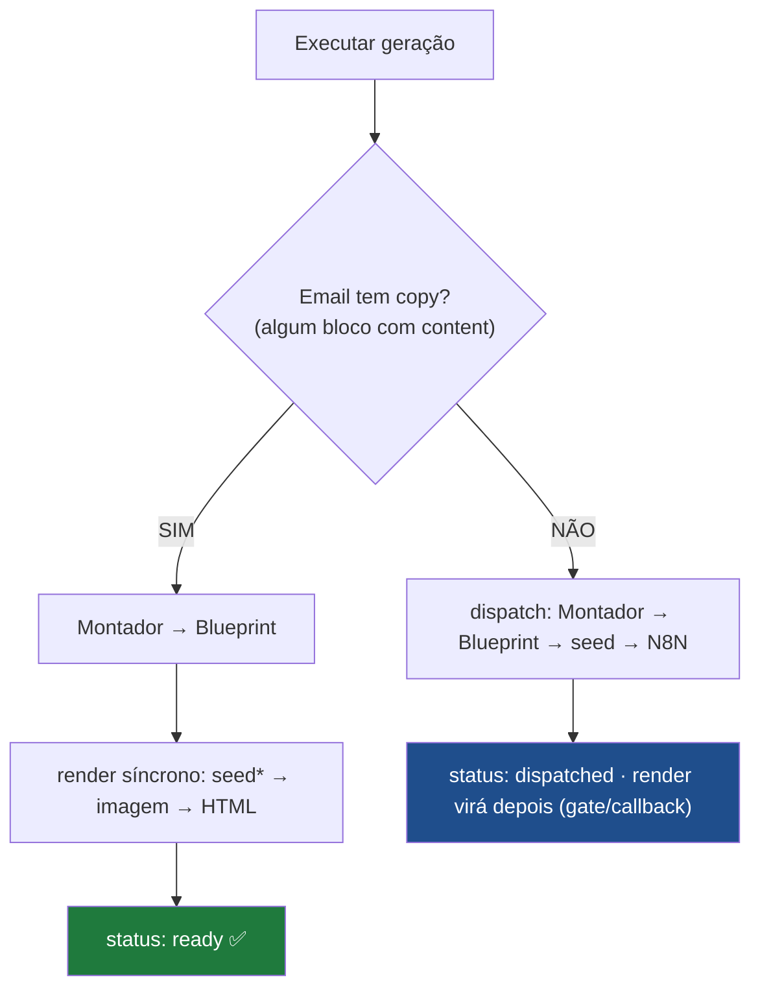

# Pipeline de Geração de Emails (Epic AE)

> Visão de ponta a ponta do pipeline de geração automática de emails, já com a
> **inversão Montador→Blueprint** (Junho/2026) e o mapa das **gerações de teste**
> do hub `/admin/settings/email-generation`.

---

## 1. Visão geral

São **2 fases assíncronas** com um **gate manual** (confirmação de brand) no meio.
Cada caixa colorida é um status de `email_flow_emails`.

**Resumo:** `Architect (Montador→Blueprint) → Seed → Copy (N8N) → ⏸ Gate de brand → Render (Imagem→HTML→QA) → Ready`.

---

## 2. Fase Architect — a inversão (mudança de Junho/2026)

O Architect roda **dentro do dispatch da copy** (`email-copy-webhook.service.ts:285-303`),
**antes** do seed e do N8N, e só se a biblioteca estiver configurada
(`isArchitectConfigured()`). A ordem interna foi **invertida**: agora o Montador
monta o HTML primeiro, e o Blueprint extrai a estrutura desse HTML.

| Ordem | Agente | Lê | Grava |
|---|---|---|---|
| **1º** | Montador (`assembleStoreReference`) | seções do **outline** + biblioteca | `store_email_references` (HTML) |
| **2º** | Blueprint (`generateStoreBlueprint`) | o **HTML montado** | `store_email_blueprints` (estrutura) |

**Por quê:** antes o Blueprint *previa* a estrutura e o Montador tentava segui-la.
Agora o Blueprint é um **espelho fiel** do HTML que o Montador realmente produziu —
os dois artefatos saem coerentes entre si.

**Fallback em cascata** (o Architect é uma camada de *personalização*, nunca bloqueia):
blueprint da loja → blueprint global → `DEFAULT_BLUEPRINTS`; reference da loja → template global.

---

## 3. Quem consome os artefatos do Architect

- **`store_email_blueprints`** → o **Seed** cria os `email_blocks` com `needs_image` correto; o **HTML agent** lê `objective`/`messaging`.
- **`store_email_references`** → o **HTML agent** usa como `reference_html` (a forma que ele segue). Sem reference da loja → template global.

---

## 4. Máquina de estados (`email_flow_emails.status`)

Toda transição vira linha em `email_status_events` (audit + bus SSE via `pg_notify`).

### Resiliência — watchdog cron (5 min)

| Situação | Detecção | Ação |
|---|---|---|
| Copy travada | `copy_generating` > 15min | → `copy_generating_recovery` → fallback in-process |
| Fase 2 travada | `rendering`/`qa_running` > 10min | → `failed:timeout_phase2` |
| `copy_ready` parada | > 3min (após o gate) | re-dispara a fase 2 |

---

## 5. Gerações de TESTE (hub `/admin/settings/email-generation`)

Há **dois testes diferentes**, que exercitam **partes diferentes** do pipeline:

### Teste A — Aba "Geradas" → **Regenerar** (testa o Architect)

| Item | Detalhe |
|---|---|
| **Rota** | `POST /api/admin/stores/[id]/generate-blueprints` |
| **Função** | `generateForEmails()` → `generateBlueprintAndReference()` por email |
| **O que roda** | Montador (HTML das seções do outline) → Blueprint (extrai do HTML) |
| **Grava** | `store_email_references` + `store_email_blueprints` |
| **Onde ver** | a própria aba mostra, por email, o **HTML montado** (iframe) + a **estrutura extraída** |
| **NÃO envolve** | copy, imagem ou HTML final — é só a camada de **estrutura/forma** |

### Teste B — Aba "Testar" → **Executar geração**

A aba **verifica se o email já tem copy** e ramifica (orquestrado por
`runTestGeneration` em `src/lib/agents/test-generation.service.ts`):

> \* No caminho **com copy**, o seed roda em modo `skipSeed` (não deleta os
> blocos), **preservando a copy** — o HTML usa `email_blocks.content`.

| Item | Detalhe |
|---|---|
| **Rota** | `POST /api/admin/stores/[id]/generate-email` |
| **Detecção de copy** | `emailHasCopy()` — algum `email_blocks.content` com ≥ 1 chave |
| **Com copy** | `generateBlueprintAndReference()` (Architect) → `generateEmail({ skipSeed: true })` (render síncrono) → `ready` |
| **Sem copy** | `dispatchEmailCopyWebhook({ flowIds:[flowId] })` — faz Architect + seed + N8N; render assíncrono depois → `dispatched` |
| **Polling** | só no caminho com copy: `GET .../generation-status/[batchId]` (tempo/tokens/custo por agente) |

Etapas exibidas na UI: **Montador → Blueprint → Seed → Copy → Imagem → HTML**.
Erros agora aparecem com a **mensagem real** (não mais `[object Object]`).

> Botão **"Pré-visualizar vars HTML"**: mostra as variáveis resolvidas que entram
> no prompt do HTML agent (debug), **sem** gerar nada.

### ⚠️ Notas

- No caminho **sem copy**, o N8N é disparado para o **flow inteiro** do email
  (`flowIds:[flowId]`), não só o email selecionado. O render vem depois, via
  gate de brand / callback (assíncrono) — por isso o status é `dispatched`.
- No caminho **com copy**, o Architect atualiza o reference/blueprint da loja e o
  HTML é regenerado **sobre a copy existente** (preservada pelo `skipSeed`).

---

## 6. Arquivos-chave

| Camada | Arquivo |
|---|---|
| Orquestrador do Architect | `src/lib/agents/architect/generate.service.ts` |
| Montador | `src/lib/agents/architect/component-assembler.service.ts` |
| Blueprint | `src/lib/agents/architect/blueprint-generator.service.ts` |
| Normalização das seções | `src/lib/agents/architect/outline-sections.ts` |
| Dispatch (Architect+Seed+N8N) | `src/lib/services/email-copy-webhook.service.ts` |
| Webhook de copy (N8N) | `src/app/api/webhooks/n8n/email-copy/route.ts` |
| Render (fase 2) | `src/lib/agents/phase2-runner.service.ts` |
| Render síncrono (teste) | `src/lib/agents/email-generation.service.ts` |
| Watchdog | `src/app/api/cron/email-generation-watchdog/route.ts` |
| Hub / abas | `src/components/email-generation/email-generation-workspace.tsx` |
| Aba "Geradas" | `src/components/email-generation/generated-inspector.tsx` |

---

*Atualizado: Junho/2026 — inversão Montador→Blueprint + aba "Geradas".*
