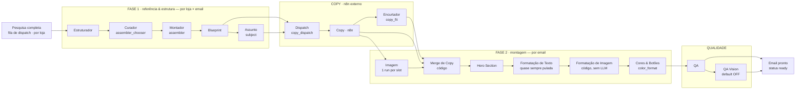

# Fluxo de geração de emails — o que entra em cada agente

*Atualizado: 31/08/2026 · base: branch `claude/resume-previous-session-UvATK` · modelos conferidos no banco de produção (`email_agent_configs`, 31/08) · fonte do grafo: `src/lib/agents/studio-graph.ts`*

Este documento mapeia **cada estágio do pipeline de geração de emails** com foco no que **entra** em cada um: toda variável de prompt/input, sua **origem concreta** (tabela/coluna, saída de agente anterior, função derivadora) e sua **classe de proveniência** — a mesma taxonomia que o Estúdio de Agentes (`/admin/agents/studio`) renderiza a partir de `prompt_segments`/`input_summary` (migration 20261085).

> Ele substitui a visão de `fluxo-agentes.md` (jul/2026), anterior ao Estruturador, ao merge por example, à montagem por código (CM‑2) e à morte do `merge_verifier`.

---

## Classes de proveniência (como ler as tabelas)

Declaradas em `src/lib/agents/shared/prompt-provenance.ts` (`PROV_CLASS_META`); os mapas `*_VAR_ORIGINS` vivem **ao lado de quem monta as vars** (regra da casa). `n8n` não é classe formal do sistema — usada aqui para payloads do workflow externo.

| Classe | Significado | Fontes típicas |
|---|---|---|
| `agente` | Template do agente (system/user) | `email_agent_configs` ou defaults in-code |
| `loja` | Dados da loja | `client_stores`, `store_briefings`, `store_brand_identity`, `store_top_products`, `onboardings` |
| `biblioteca` | Biblioteca de componentes | `email_component_variants` (catálogo, schemas, HTML canônico) |
| `upstream` | Saída de agente anterior | `store_email_references`, `store_email_blueprints`, `email_blocks.content`, copy do n8n |
| `curadoria` | Curadoria global / correção humana | `email_outline_templates`, `email_blueprints`, `email_structure_reviews`, orientações do COO |
| `vault` | Material validado do Obsidian | `email_intents`, `email_structure_refs`, `email_learnings` |
| `sistema` | Derivado por código | funções derivadoras, identidade do email, envs, filas |
| *(n8n)* | Workflow externo | callbacks `/api/webhooks/n8n/*` |

---

## Visão geral do pipeline

Grafo real (decisão ago/2026 — `studio-graph.ts`): **merge roda ANTES da hero** (D1, 20/08) e o verificador de merge morreu com a fila de exceção.

**Máquina de status** (`email_flow_emails.status`, intocada pelo split): `draft → pending/in_progress → copy_generating → copy_ready → rendering → image_done → (rendering) → qa_running → ready | failed`. A cadeia hero→texto→imagem→cores roda **inteira** dentro de `rendering`; a granularidade vem de `html_pipeline_stage` (último step **concluído**: `hero` | `text` | `image` | `null`) e das runs em `email_generation_runs`.

**Dois portões humanos:**

- **GATE 1 — briefing confirmado**: trigger SQL em `store_briefings.status='confirmed'` → sinal `start` em `email_generation_queue_signals` → `startOnboarding` despacha copy (payload leve) pro n8n.
- **GATE 2 — identidade visual confirmada**: trigger em `store_brand_identity.confirmed_at` → sinal `render` → fase 2 dispara para os emails em `copy_ready`. Sem brand confirmada, o email **fica** em `copy_ready` (nunca vira `failed`).

**Fluxo natural**: callback `pesquisa-completa` (n8n) → job em `email_dispatch_jobs` → cron `email-dispatch-queue` (a cada minuto) roda o Architect (Estruturador→Curador→Montador→Blueprint) por email em lotes de 4 e, com todos *settled*, dispara o payload de copy **v3** pro n8n uma única vez.

---

## Modelos ativos (banco de produção, 31/08/2026)

`email_agent_configs` com `is_active=true`. Id com `/` roteia via **OpenRouter** (custo real `usage.cost`); sem `/` usa o **SDK Anthropic** direto. Prompts vazios no banco → defaults in-code do chain.

| Agente | Modelo ativo | T | max_tokens | Observação |
|---|---|---|---|---|
| estruturador | `anthropic/claude-sonnet-4.6` | 0.4 | 8192 | seed 4096 já corrigido no banco |
| assembler_chooser (Curador) | `moonshotai/kimi-k3` | 0.2 | 8192 | catálogo inteiro no system (cacheável) |
| assembler (Montador) | `moonshotai/kimi-k3` | 0.3 | 2048 | só escolhe JSON (~500 tokens); default in-code opus‑4.8 é apenas fallback |
| blueprint (rota LLM) | `moonshotai/kimi-k3` | 0.4 | 8192 | rota determinística grava `model='deterministic'` |
| subject | `anthropic/claude-sonnet-4.6` | 0.7 | 400 | mini‑LLM da rota determinística |
| copy (fallback in-process) | `claude-opus-4-7` | 1.0 | 20480 | a copy de produção roda no **n8n** (modelo externo) |
| copy_fit | `openai/gpt-5.4-mini` | — (reasoning `low`) | 6000 | encurtador condicional (tamanho, travessão, idioma, item ausente) |
| image | `google/gemini-3.1-flash-image` | — | — | temperatura não é enviada; sempre OpenRouter |
| hero_section | `anthropic/claude-sonnet-4.6` | 0.3 | 16384 | espelho visual troca p/ `hero_vision_model` |
| text_format | `moonshotai/kimi-k3` | 0.3 | 65536 | quase sempre **pulado** (merge por example) |
| image_format | `moonshotai/kimi-k3` | — | — | config é só kill‑switch: step é **100% código** |
| color_format | `moonshotai/kimi-k3` | 0.3 | 16384 | fail‑open |
| qa | `moonshotai/kimi-k3` | 0.2 | 1500 | LLM desligado por default (`EMAIL_QA_ENABLED`) |
| merge_verifier | `moonshotai/kimi-k3` | — | — | **config órfã** — agente morto em 20/08 |

Briefing (etapa 0) não usa `email_agent_configs`: cascata hardcoded `claude-sonnet-4-6` (Anthropic) → `openai/gpt-5.3-chat` (OpenRouter) → template determinístico.

---

## Etapa 0 — Contexto por loja: Briefing + Pesquisa & Diagnóstico

Roda **antes** do pipeline e alimenta todos os agentes. Quatro sub-passos: (A) geração do briefing do onboarding; (B) webhook outbound pro n8n na confirmação; (C) callbacks do n8n com os 5 pilares da Pesquisa; (D) serialização determinística (`store-context.ts`) consumida pelos prompts downstream.

**Modelo (A)**: cascata T1 `claude-sonnet-4-6` (40s) → T2 `openai/gpt-5.3-chat` (20s) → T3 template determinístico. T=0.3, max 4096. Hardcoded — sem linha em `email_agent_configs`, sem `*_VAR_ORIGINS` (classes derivadas por leitura).

### Entradas do Briefing (A)

| Entrada | Origem | Classe |
|---|---|---|
| system prompt | `SYSTEM_PROMPT` in-code (fidelidade, shape JSON de 5 campos, sem URLs) | agente |
| PESQUISA_E_DIAGNOSTICO | `pesquisaToFullText(client_stores.*)` — `brand_*`, `store_story/milestones`, `icp_*`, `tone_*`, `ads_*` | loja |
| DADOS_DA_LOJA | `client_stores.store_name/store_url/platform/niche/country/currency/language/free_shipping_type` | loja |
| CLIENTE | `clients.name` (FK `onboardings.client_id`) | loja |
| RESPOSTAS_DO_FORMULARIO | `onboardings.form_responses` (filtrado por `stripStorageFromResponses`) | loja |

A pesquisa é a **fonte primária** declarada no prompt; o formulário cobre lacunas. Saída: `onboardings.briefing` + `briefing_ai_original` (JSON `BriefingContent`), status `generating → generated_pending_review → approved`.

### Callbacks da Pesquisa (C) — o que cada um grava

| Callback (n8n) | Persiste em |
|---|---|
| `/n8n/brand` | `client_stores.brand_thesis / brand_about / brand_pillars / brand_presence` |
| `/n8n/store-story` | `client_stores.store_story / store_milestones` |
| `/n8n/icp` | `client_stores.icp_persona / icp_demographics / icp_day_in_life / icp_motivations / icp_frictions` (+ blocos avançados opcionais) |
| `/n8n/tone` | `client_stores.tone_description / tone_do / tone_dont / tone_use_words / tone_avoid_words` |
| `/n8n/ads-analyzer` | `client_stores.ads_score / ads_summary / ads_sub_scores / ads_strengths / ads_opportunities / ads_risks` |
| `/n8n/competitors` | `client_competitors` (replace só de `source='trendtrack'`) |
| `/n8n/top-products` | `store_top_products` (replace atômico) |
| `/n8n/briefing-markdown` | `store_briefings` (versionado; dedup por markdown idêntico) |
| `/n8n/pesquisa-completa` | **gatilho do pipeline**: `enqueueDispatchJob` em `email_dispatch_jobs` (`regeneration=true` só atualiza pesquisa) |

Guards: `requireWebhookSecret` (timing-safe) em todos; `assertStoreUrlMatches` (409 anti-contaminação de loja); Zod por callback; fail-open via `after()`.

### Ponte determinística (D) — `store-context.ts`

Funções que serializam o contexto para os prompts da fase 1 (e reutilizadas por copy-fallback, fase 2 e imagem):

- `resolveBrandProfile` → `<perfil_marca>`: `store_briefings.marca` → `pesquisaToFullText(sem ads)` → "(sem perfil…)"
- `resolvePersonaText` → persona: `marca.persona` → `icp_persona`+`icp_demographics` → coluna legada (só string)
- `resolveObjecoes` → `client_stores.icp_frictions` (bullets literais)
- `resolveVocabulario` → `tone_use_words`/`tone_avoid_words` (**literal, nunca truncado**)
- `loadTopProducts`/`renderTopProducts` → `store_top_products` (top 5; URL = `store_url + '/products/' + handle`)
- `fieldOrMissing` → ausência é **declarada** ("(não cadastrado — deduza de <perfil_marca>)"), nunca omitida

---

## Orquestração — gatilhos, filas, máquina de status, watchdog

Estágio 100% código (sem LLM). Peças:

- **`email_generation_queue_signals`** — sinais `start` (GATE 1) / `render` (GATE 2) / `rerender`, inseridos por triggers SQL **fail-open**, consumidos pelo watchdog (claim `pending→processing`, retry até 3×).
- **`email_dispatch_jobs`** — fila do Architect: 1 job ativo por loja (UNIQUE parcial), lease otimista por `updated_at` (360s), lotes de 4 emails por tick (`DISPATCH_ARCHITECT_BATCH`), budget 45s/tick; com todos settled → `dispatchEmailCopyWebhook` **uma vez**.
- **`email_status_events`** — audit append-only de toda transição de status (trigger `fn_log_email_status_change` + `pg_notify`) — bus do live view.
- **Seed de blocos** (`seed-blocks.ts`, determinístico) — materializa `email_blocks` a partir do blueprint: `block_type` sanitizado, `position`, `needs_image`, **`variant_id` + `fields`** ("o bloco É o schema", migration 20261065).
- **Watchdog** (`/api/cron/email-generation-watchdog`, `1-59/5 * * * *`): 6 frentes — consome sinais; recupera copy travada >15min (`copy_generating_recovery` → fallback in-process, cap 3 attempts); mata fase 2 >25min (`timeout_phase2`, idade real via telemetria — `classifyStaleBatch`); re-dispara `copy_ready` parado >3min (só com brand confirmada); retoma in-process `image_done`/`rendering` entre 15–25min (budget 240s); fecha runs `running` órfãs >20min.
- **Fase 2**: `runPhase2Image` (claim `copy_ready→rendering`) → `runPhase2HtmlQa` (claim `image_done|rendering→rendering`, renova `rendering_started_at`) → cadeia de formatação → QA → `ready`. Claims são UPDATEs condicionados por status (idempotentes); **resume** por `html_pipeline_stage` + budget dinâmico (`out_of_budget` nunca vira `failed`).

Existem **dois dispatchers de copy** para o mesmo `N8N_EMAIL_COPY_WEBHOOK_URL`: `startOnboarding` (GATE 1/manual — payload leve, marca `copy_generating`) e `dispatchEmailCopyWebhook` (fluxo natural pós-pesquisa — payload v3 completo, marca `in_progress`). Ambos convergem no mesmo callback.

---

# FASE 1 — Referência & estrutura (por loja × email)

Guard de **reuso**: sem `force` e com `estruturador_mode != 'on'`, se `store_email_references` + `store_email_blueprints` já existem, a fase 1 inteira é pulada (`referenceSource='store'`). Com Estruturador `on`, a estrutura é re-decidida a cada geração (ADR estruturador-adaptativo). Emails `text_only` pulam tudo.

## 1 · Estruturador

Decide o **esqueleto** do email (sequência de seções + papel narrativo por posição + fio narrativo + justificativas) traduzindo o material do vault para a objeção dominante da loja. Modos (`email_generation_settings.estruturador_mode`): `off` (run `skipped`) · `shadow` (roda e grava run, pipeline segue na Arquitetura) · `on` (**vigente desde 02/09, migration 20261106** — a sequência do email é a dele). A run em `email_generation_runs` **é** a persistência (não há tabela própria). Mapa completo dos dois agentes em `mapa-estruturador-curador.md`.

**Modelo**: `anthropic/claude-sonnet-4.6` (OpenRouter) · T 0.4 · max 8192 · timeout 240s · retry 1× **só quando o JSON vem ilegível/truncado** (o validador de conteúdo saiu em 02/09 — o que ele devolver vale; `normalizarOutput` garante só a forma `estrutura[]` com `section`+`papel`).

### Entradas (origens declaradas em `SYSTEM_ORIGINS`/`USER_ORIGINS`)

| Entrada | Origem | Classe |
|---|---|---|
| `intencao_flow` | `email_intents.body_md` (slug `_flow`, por flow_type) | vault |
| `progressao` | `email_intents.body_md` (kind `progressao`) | vault |
| `referencias` | `email_structure_refs` (por flow_type, embrulhadas por slug — contrato anti-alucinação) | vault |
| `aprendizados` | `email_learnings` (flow ou globais com `aplica_a`) | vault |
| `intencao_email` | `email_intents.body_md` (flow_type + email_number exatos; ausente → `sem_material`, não roda). **Sem** as intenções por bloco da Arquitetura (02/09 — a sequência é dele) | vault |
| `brand_name` + `pesquisa` + `top_products` (bloco `<perfil_da_marca>`) | nome da loja + `pesquisaToFullText` — dossiê **completo, com Ads** (01 Perfil da Marca · 02 Sobre a loja · 03 Cliente Ideal · 04 Tom de Comunicação · 05 Review dos Anúncios) + top 5 produtos com preço e link (`renderTopProducts`). Os campos soltos nicho/posicionamento/persona/tom saíram em 02/09 (eram derivados do dossiê) | loja |
| `flow_type` / `email_number` | identidade do email (input do pipeline) | sistema |
| `secoes_disponiveis` | só os **nomes** das categorias com variante ativa em `email_component_variants` (sem contagem, sem nº de produtos) | sistema |
| `estruturas_dos_outros_emails` | runs `estruturador` success dos **irmãos** do flow (anti-repetição; no retry recebe o erro de parse) | sistema |
| `orientacao_coo` | `estruturador_orientacoes` (global→flow→email; efeito imediato, **não** é vault) | curadoria |
| `revisao_humana` | `email_structure_reviews` (diff ordem_anterior→nova; sinal forte, não trava) | curadoria |

**Saídas**: `parsed_output` da run (diagnóstico, estrutura[], fio_narrativo, fontes, aprendizados_aplicados, descartes + `_validador` informativo: retry de parse, revisão humana seguida ou não, convergência com a geração anterior). Em modo `on`: vira a `structure` do Montador e do Curador, a **saída COMPLETA em JSON** na var `estruturador_decisao` do Curador (`decisaoCompletaParaCurador`, clamp 24k), `fio_narrativo` do blueprint (`store_email_blueprints.fio_narrativo`) e 1ª linha do `purpose` de cada bloco.

**Guards**: só a forma (`normalizarOutput`); fallback integral para a Arquitetura quando ele falha (nunca derruba a geração); precedência declarada no prompt: intenção do flow > revisão humana > orientação COO > aprendizados > referências. Seção fora da biblioteca (`header`, `cta`) chega ao Curador, que devolve `escolhas: []` e o slot cai no template global.

## 2 · Curador (`assembler_chooser`)

Recebe o **catálogo inteiro** da biblioteca no system (cacheável entre lojas) e rankeia até **3 variantes por posição** (motivo só na 1ª). Decide por nome/descrição/metadados — **nunca vê HTML nem output_schema**. **Fail-closed**: sem ranking utilizável após retry → `CuratorFailedError` (falha visível, sem composição arbitrária).

**Modelo**: `moonshotai/kimi-k3` · T 0.2 · max 8192 · timeout 240s · retry 1×.

### Entradas (declaradas em `editorialOrigins`)

| Entrada | Origem | Classe |
|---|---|---|
| `{{catalogo}}` (system) | `buildCatalog` sobre `email_component_variants` ativas e **preenchíveis** (`variantIsFillable`): name, description, quando_usar/não_usar, objectives, tones, density, product_slots, orientação de copy, notas | biblioteca |
| `blocks_json` (sequência) | posições do Estruturador (modo on) **ou** `resolveStructure(email_outline_templates.suggested_blocks, email_blueprints.blocks)` + `clampStructure`; posição com **`intencao`** = purpose escrito na aba Arquitetura (`anexarIntencoes`) | upstream / sistema / curadoria |
| `estruturador_decisao` | saída **completa** do Estruturador em JSON (`decisaoCompletaParaCurador`) — só em modo `on` com run ok. No Curador do **vault** (o vigente) entra no bloco `<decisao_do_estruturador>` e é o critério DOMINANTE por posição; com ela, `<estruturas_de_referencia>` e `<outline>` são omitidos | upstream |
| `lacunas_biblioteca` (vault) | `email_vault_docs` kind `lacuna` (`componentes/lacunas/*.md`), das seções do email — `buildLacunasBlock`; lacuna pesa contra, não elimina | vault |
| `indice_vault` (vault) | árvore de pastas do Obsidian derivada do `file_path` das 4 tabelas sincronizadas (`buildIndiceDoVault`) + ferramentas `listar_pasta`/`ler_nota` (`curador-vault-tools.ts`, até 4 consultas por run via `invokeAgentWithTools`); cada consulta fica em `consultas_ao_vault` na telemetria | vault |
| `outline_objective` / `tone_hint` | `email_outline_templates` | curadoria |
| `outline_guidance` | `fio_narrativo` do Estruturador (on) **ou** `email_outline_templates.guidance` | upstream / curadoria |
| `intencao_flow` / `intencao_email` | `email_intents` (clamp 4000) | vault |
| `revisao_humana` | `email_structure_reviews` com `para_curador=true` | curadoria |
| `briefing_marca` | `resolveBrandProfile` (**sem** o review de Ads) | loja |
| `objecoes` / `vocabulario` / `top_products` / brand_name / nicho / posicionamento / persona / tom_voz | store-context (client_stores / store_briefings / store_top_products) | loja |
| `memoria` | `email_generation_choices` — email N‑1 da mesma loja (coerência) + mesmo email em até 3 lojas do org (variedade) | sistema |

**Intenção por bloco (02/09)** — vale quando o Estruturador está `off`/falhou (com ele `on`, a sequência é dele e as intenções da Arquitetura não entram): a aba Arquitetura ganhou o campo "Intenção deste bloco" (`ArchBlock.purpose` → `email_blueprints.blocks[].purpose`). `resolveStructure` anexa cada intenção à posição (índice a índice; tamanhos diferentes casam pela 1ª ocorrência livre da categoria), o rótulo (`componente`) vira a intenção truncada e o JSON leva `intencao`. Os dois Curadores têm a regra "a intenção É o papel da posição; rankeie por ela antes da intenção do email"; o Estruturador (modo on) a recebe dentro de `<intencao_do_email>` (`comIntencoesPorBloco`). No blueprint, `combinarIntencaoComPapel` (estruturador-consume) põe a intenção na 1ª linha do `purpose` e o papel do agente embaixo ("Papel (Curador): …") — **mesmo sem agente** (antes `papeisPorPosicao` saía null e o purpose virava só o `copy_guidance`). Por esse purpose a intenção chega ao n8n (`bloco.purpose` + `schema.diretriz`) e ao agente de imagem (`blueprint_purpose`). Telemetria: `intencoes_humanas` no run do Curador + "Intenções por bloco (Arquitetura): N de M" na Entrada.

**Saída**: ranking por posição (em memória → Montador) + memória em `email_generation_choices`. O catálogo (~120k chars) viaja na telemetria como `{ref:'catalogo', sha8}` — a UI resolve sob demanda.

## 3 · Montador (`assembler`)

Desde CM‑2/CM‑4 o Montador **não escreve HTML**: o LLM recebe os finalistas do Curador **+ o output_schema compacto de cada um** (insumo exclusivo dele) e escolhe **1 variante por posição** olhando o email inteiro; razões fechadas para sair do rank 1. A montagem do documento é **100% código** (`assembleDocument`): concatena o HTML **canônico** das variantes (`email_component_variants.html` — a camada `html_tagged`/Taguedor foi **removida** em 20/08) no shell de 600px com marcadores `cfy:block:{i}:{section}`, CSS reinjetado e fontes da loja normalizadas. **Fail-open**: falha do LLM degrada para o rank 1 do Curador.

**Modelo**: `moonshotai/kimi-k3` · T 0.3 · max **2048** (output = JSON de escolhas, ~500 tokens).

### Entradas

| Entrada | Origem | Classe |
|---|---|---|
| `finalists_json` | ranking do Curador + `campos` = output_schema compacto (`key/label/type/nature/max_len/required`) das variantes | upstream (+ biblioteca) |
| vars editoriais | mesmas do Curador (`brand_name`…`memoria`, `revisao_humana` com `para_montador=true`) | loja/curadoria/vault/upstream |
| *(código)* structure/slots | Estruturador (on) ou outline + `clampStructure` | sistema |
| *(código)* HTML canônico | `email_component_variants.html` das escolhidas (placeholders/examples intactos p/ o merge) | biblioteca |
| *(código)* fontes da loja | `store_brand_identity.font_heading/font_body` (webfont + `normalizeFonts`) | loja |
| *(código)* template global | `email_reference_templates` — **só** fallback de retorno quando a biblioteca não cobre nada | curadoria |

**Saídas**: `store_email_references` (`html`, `variant_ids`, `slot_map` com `assembled`, `source='ai'`, `model='code'`) + retorno em memória `{html, slots}` pro Blueprint. Guards: parser com fallback rank 1, `dedupeDecisions`, `garantirHeroUnica` (máx 1 hero por email — telemetrizada), self-check de marcadores e de tags de imagem.

## 4 · Blueprint (+ 4b Assunto)

Transforma slots + HTML montado no **contrato de copy** por email: `objective`, `messaging`, `subject_hint`, `fio_narrativo` e `blocks[]` com **fields v2** — a fonte única do payload do n8n. **Duas rotas** (`email_generation_settings.blueprint_mode`): **A determinística** (builder puro por slots; gate: todo slot com `output_schema`; custo ~zero; mini‑LLM `subject` gera subject_hint+messaging) e **B LLM fallback** (extrai a estrutura do `reference_html`). As duas terminam no normalizador único `packageBlueprint` — **dado curado da biblioteca vence o LLM**; o n8n nunca percebe a rota.

**Modelos**: rota A `model='deterministic'` + subject `anthropic/claude-sonnet-4.6` (T 0.7, max 400); rota B `moonshotai/kimi-k3` (T 0.4, max 8192).

### Entradas

| Entrada | Origem | Classe | Rota |
|---|---|---|---|
| `slots` | saída do Montador (mesmo run, em memória) | upstream | A |
| `variant.output_schema` | `email_component_variants.output_schema` → fields v2 (`fieldsFromSchema`), `image_brief`, `needs_image` | biblioteca | A |
| `variant.copy_guidance/description` | `email_component_variants` → `purpose` do bloco (vence o LLM) | biblioteca | A/B |
| `variant.html` | `email_component_variants.html` → `fitBudgets`/`measureSlot` **mede a caixa real** e aperta `max_len` ("só aperta, nunca afrouxa") + auditoria de âncoras | biblioteca | A |
| `reference_html` | HTML do Montador | upstream | B |
| `pesquisa_diagnostico` | `pesquisaToFullText` (com Ads) | loja | B |
| outline (`objective/guidance/tone_hint/suggested_blocks`) | `email_outline_templates` | curadoria | A/B |
| vars de loja (`brand_name/nicho/posicionamento/persona/tom_voz/top_products`) | client_stores / store_briefings / store_top_products | loja | A/B |
| `copy_guidance_resumo` (subject) | `copy_guidance` das variantes casadas | biblioteca | A |
| `papeisPorPosicao` / `fioNarrativo` | saída do Estruturador (modo on) | upstream | A/B |
| fallbacks | `email_blueprints` global → `DEFAULT_BLUEPRINTS` in-code → mínimo hero/text/footer | curadoria/sistema | B |

**Saídas**: `store_email_blueprints` (upsert; rota B em fallback **não** persiste — preserva o anterior). Consumidores: dispatch de copy, seed de blocos, cascata da hero na fase 2, QA.

---

# COPY (n8n externo)

## 5 · Dispatch (`copy_dispatch`) — código

Monta e POSTa o **payload v3** ("o bloco É o schema") pro n8n. Timeout 15s (fire-and-forget); o payload **íntegro** fica em `input_vars.payload` da run (digest acima de 1MB). Reseta os emails despachados para `in_progress`.

**O payload leva** (classes declaradas no `input_summary` da run):

- `store` completo: identidade (`client_stores`), 5 pilares da Pesquisa (`brand/icp/tone/story/ads_review`), posicionamento legado, visual, operações, audiência, **idioma efetivo** (`resolveStoreLanguage` — coluna > formulário > default) — *loja*
- `brand_identity` (logo, paletas, fontes, voice — `store_brand_identity`) — *loja*
- `briefing` (`store_briefings.marca/briefing`) — *upstream* · `pesquisa_diagnostico` serializada — *loja* · `top_products` + `competitors` — *loja*
- por flow/email: identidade, `text_only`, `dispatch_batch_id` (eco anti-stale), `objective` (cascata blueprint→outline→default), `tones` (`deriveToneKeys`), `estrutura_geral` (outline), `blueprint {objective, messaging, subject_hint, fio_narrativo}` — *upstream/curadoria*
- por bloco: `block_id/position/type/label`, `variant_id`, `purpose` e **`schema.campos`** = contrato de resposta derivado de `email_blocks.fields` (só campos `nature='copy'`; `max_caracteres` já **medido na caixa**) — *biblioteca*
- filtros: mixed mode (só blocos vazios, salvo `regenerateAll`), MC‑1 (bloco cuja variante a montagem descartou sai do payload), MC‑2 (email sem seção montada → `failed: sem_secao_montada`)
- `test_context` (aba Testar) — vai **só** pro n8n, nunca pro Architect

## 6 · Copy (n8n) + callback

A copy é gerada por **LLM externo** (modelo do flow do n8n; ecoado em `meta.model`). O callback `/api/webhooks/n8n/email-copy` (por email) valida (secret timing-safe, anti-spoof store↔email, anti-stale por `dispatch_batch_id`, idempotência por status), **desembrulha** envelopes (`normalizeCopyEnvelope`), resolve tokens de marca (`{{BRAND_NAME}}` → nome real) e **tokens de cupom** (`[DISCOUNT_CODE]`, `[COUPON]`, `{{COUPON_CODE}}`… → `email_outline_templates.coupon_code` do email, a mesma fonte que o dispatch manda; sem código o token fica e vira `log.error` + `parsed_output.cupom.placeholder_sem_codigo` — 02/09: o payload levou `BEMVINDO10` e a hero voltou com `[DISCOUNT_CODE]`), grava `subject/preheader` em `email_flow_emails` e `content` por `block_id` em `email_blocks`, audita contra o contrato (`findFieldDeviations` — observabilidade, **nunca rejeita**) e marca `copy_ready` (ou `ready` se text_only). A fase 2 fica **diferida ao GATE 2**.

**Fallback in-process** (`copy-chain-fallback` + `copy.chain`): só quando o watchdog claima email travado >15min. Modelo ativo `claude-opus-4-7` (LangChain/Anthropic). Prompt bem mais pobre: `store_briefings.marca` (slogan/tom/persona/diferencial/posicionamento), restrições, top products, objective/messaging do blueprint efetivo e `blocks_json` **sem fields** — sem pesquisa, sem schema.

## 7 · Encurtador (`copy_fit`)

Condicional, roda **inline no callback** (passo 3.6): recebe **só os campos com problema** e propõe reescritas; quem aceita é o **código** (`aceitarReescrita` recusa vazio/idêntico/ainda-acima/cresceu/abaixo-do-mínimo/traço-permaneceu/idioma-permaneceu). Máx 2 passadas; **fail-open** total. Kill-switch por org: `email_generation_settings.copy_fit_mode`.

**Modelo de raciocínio (02/09)**: GPT-5.4 mini pensa antes de responder e o `max_tokens` cobre as duas coisas. A primeira run nele (5d7396b5) herdou 1500 tokens e esforço `medium`: gastou tudo pensando, devolveu texto vazio e o run registrou "Unexpected end of JSON input". Agora o chain pede `reasoning: {effort: "low"}` (`AgentInvokeConfig.reasoning`, só para modelos `gpt-5*`), o teto é 6000 (migration 20261105) e resposta vazia vira erro nomeado com `finish_reason`/`tokens_saida`/`reasoning_tokens` (`motivoDaSaidaVazia`) — a mesma mensagem chega ao `erro` do run `copy`.

**Três motivos de alvo** (`MotivoDeAlvo`, um campo pode ter mais de um):

| Motivo | Entra quando | Migration |
|---|---|---|
| `max_len` | passou do limite da caixa | 20261089 |
| `travessao` | tem `—` ou `–` (entra mesmo cabendo) | 20261095 |
| `idioma` | voltou em língua diferente da da loja | 20261099 |

O `idioma` existe porque a ordem de idioma **vai** no payload do n8n em três
lugares (raiz, `store` e prefixando `pesquisa_diagnostico`) e o flow nem
sempre a aplica. O detector (`lib/email-workspace/idioma-copy.ts`, puro) é
conservador — rótulo curto, cupom e frase ambígua saem como `indefinido` e
NÃO viram alvo, porque falso positivo aqui reescreveria copy correta. O
desvio vira número em `parsed_output.idioma` do run `copy` **mesmo com o
encurtador desligado**: é a medida do que o flow ignora.

**O idioma da loja é declaração GLOBAL, não marca por campo** (incidente
01/09, migration 20261100). A primeira versão marcava só o campo divergente
(`reescrever_no_idioma`) e dizia no prompt "por padrão mantenha o mesmo
idioma; a ÚNICA exceção é…". Num prompt inteiro em português, essa
construção condicional ensinou o modelo a trocar de língua: o n8n mandou o
Welcome 1 da Innova Bay **em inglês**, os 14 campos entraram por tamanho e
travessão e voltaram **todos em português**. Agora o `{{idioma_alvo}}` abre o
user template e vale para todo campo.

**O guard vale em TODO alvo**, não só nos de idioma — foi essa assimetria que
deixou as 14 traduções passarem (não estavam vazias, não eram idênticas,
encurtaram, não tinham traço). `aceitarReescrita` recusa com
`mudou_de_idioma` qualquer reescrita cuja língua fuja da da loja, mais a
regra do acento que aparece do nada (`introduziuAcentoEstrangeiro`) para o
campo curto onde o detector se cala: "Vehicle Diagnostics" → "Diagnóstico".
Contagem em `traducoes_recusadas`; os pares reais do incidente são teste de
regressão em `copy-fit.test.ts`.

**Sem plano B em código (02/09, revisado no mesmo dia).** Houve um corte
por código (`encurtarPorFrase`: última frase que cabe, `—`→vírgula) para o
campo que o modelo não coube em duas passadas. No Welcome 1 da Innova Bay
ele decepou 6 de 8 campos no primeiro ponto ("Plugs directly into any
standard outlet." no lugar do parágrafo). **Removido a pedido do owner**:
o código não mexe em travessão nem corta frase. Campo recusado duas vezes
fica como veio do n8n, contado em `mantidos` com o motivo (`de_para[].motivo`
= `ainda_acima_do_limite`, `traco_permaneceu`…). O contrato segue com
`alvo_caracteres = floor(max × 0.85)`.

**Item ausente (02/09)**: item de lista (`_item_N`) vazio com ≥ 2 irmãos
preenchidos vira alvo `ausente`; o contrato leva `criar_item_da_lista` +
`itens_irmaos`; guard `igual_a_irmao` + idioma + max. Não criado → o merge
remove badge + linha (`itens_removidos`).

**Modelo**: `openai/gpt-5.4-mini` (OpenRouter, migration 20261104 — o Haiku
4.5 devolvia ~177 chars para max 130 nas duas passadas) · T 0.4 · max 1500.

| Entrada | Origem | Classe (declarada em `COPY_FIT_ORIGINS`) |
|---|---|---|
| `brand_name` | `client_stores.store_name` | loja |
| `tom_voz` | `client_stores.tone_description ?? tom_de_voz` | loja |
| `contrato_json` | `email_blocks.fields` (label, max/min, orientação — do output_schema da variante; max já medido na caixa por `fitBudgets`/`measureSlot`) | curadoria |
| `copy_atual_json` | textos do n8n com problema (`email_blocks.content`), com `travessoes_agora`/`idioma_agora` | upstream |
| `idioma_alvo` | `client_stores.language` via `resolveStoreLanguage` — declaração global no topo do template | loja |

---

# FASE 2 — Montagem (por email, status `rendering`)

Disparo: GATE 2 → `runPhase2Image` → `runPhase2HtmlQa` → cadeia `copy_merge → hero → texto → imagem → cores` → QA. Resume por `html_pipeline_stage`; retry 1× por step (contado no banco, cross-invocação); budget dinâmico com headroom 30s; kill-switch individual por agente na aba Agentes (`is_active`).

## 8 · Imagem — 1 run por slot (03/09: direção + briefing do campo são a fonte principal)

> Migration 20261108. O prompt tem três camadas com peso declarado —
> `CFY_PRIMARY_BRIEF` (direção fotográfica da variante, medidas apagadas,
> frases inteiras), `CFY_THIS_FRAME` (slot do campo: `especificidade` +
> `onde_fica` + formato + `papel_neste_grupo` nas thumbs) e `CFY_SUPPORT`
> (fio, papel do bloco, marca). Saíram a frase de cena por bloco/flow, o
> `CENARIO`/`MOOD` derivados e o "prompt master". Anexos rotulados
> `CFY_REF_PRODUCT` (produto DO CAMPO, `pickProductForField`) e
> `CFY_REF_ANCHOR` (thumbs). O restante desta seção descreve a mecânica,
> que não mudou.

Gera as fotos via OpenRouter (chat completions com saída de imagem). Cada campo `nature='imagem_gerada'` do schema do bloco vira **uma chamada própria**, em 2 ondas (âncoras → dependentes com a foto da âncora como referência img2img) + avatares de testimonials (prompt in-code, cap 4). Concorrência 6; teto 24 imagens; budget da fase 600s.

**Modelo**: `google/gemini-3.1-flash-image` (constante + config; rollback do gpt‑5.4‑image‑2 por loop de whitespace). Timeout 90s headers / 300s corpo.

### Entradas (declaradas em `IMAGE_VAR_ORIGINS` — 49+ vars; principais)

| Entrada | Origem | Classe |
|---|---|---|
| `IMAGE_SLOTS` | schema da variante filtrado pelo slot: tag, especificidade (`image_spec/guidance`), exemplo, formato (WxH/aspect), `slot_note` (comentário do designer no HTML) + `areas_de_texto` (papel e tamanho de cada campo de copy do grupo — desde 01/09 a copy LITERAL não vai mais: o modelo desenhava a headline e o cupom no PNG) | biblioteca |
| `PHOTO_DIRECTION` | `email_component_variants.photo_direction` — brief primário do fotógrafo | biblioteca |
| `EMAIL_OBJETIVO` / `EMAIL_IDEIA` / `EMAIL_ASSUNTO` | blueprint efetivo (`objective`, `fio_narrativo ?? messaging`, `subject_hint`) | upstream |
| `IMAGE_BRIEF` | blueprint (só quando `IMAGE_SLOTS` vazio — legado) | upstream |
| identidade visual | `store_brand_identity`: paletas (`PALETA_1/2`, `NEUTRO`), fontes, `logo_url`, `LOGO_STYLE`, `BG_COLOR` (`deriveColorRoles` — funde foto↔seção) | loja |
| produtos | `store_top_products` (nomes, imagens, `PRODUTO_HEROI`) | loja |
| marca/contexto | `brand_name`, `nicho`, `posicionamento`, `PUBLICO` (persona), `IDIOMA`, `MOEDA` | loja |
| `INSTRUCAO_ADICIONAL` | `email_blocks.content.image_instruction` (operador) | loja |
| derivações | `CENARIO` (nicho→cenário), `MOOD` (tom→mood), `SHOT_ARCHETYPE` (matriz welcome/regex), `mode` (`product_ref`/`text2img`), `aspect_ratio` (cascata), overlay | sistema |
| apêndices fora do template | geometria (dims do schema **vencem**), fidelidade ao produto (in-code), descrição fallback | sistema/agente |
| anexos multimodais | foto do produto (`store_top_products[0].image_url`, após `isUsableProductImage`) e foto da **âncora** do grupo | loja/upstream |

**Saídas**: PNG no Storage (`onboarding-visual-assets`, URL assinada 365d) → `email_blocks.content.images[fieldKey]` (+ espelho `image_url/image_alt`, avatares em `items[]`) + `overlay_luminance` medida (sharp) — consumida depois pela correção de texto da hero. Status → `image_done`. Reuso quando `generate_images=false`: URLs recuperadas **da telemetria** (runs success).

## 9 · Merge de Copy + Enxerto da hero — código puro

Rodam quando `html_pipeline_stage` é null (primeiro passe):

- **Enxerto** (`graftHeroVariant`): só para reference **legada** (`referenceSource !== 'assembler'`) — substitui a região da hero pelo HTML canônico da variante (cascata `resolveHeroVariant`: **blueprint → slot_map → choices**; o blueprint vence porque é o contrato de endereçamento da copy) + `normalizeFonts`. Sentinelas `cfy:hero`. Status `grafted / no_region / no_variant / invalid_variant / skipped_assembled`.
- **`copy_merge` por example** (D1, 20/08): o endereço do campo é a **frase do `example`** do schema (`anchor-match` normaliza tipografia/entidades/caixa, costura frases partidas por ` `, escreve **todas** as ocorrências + espelhos MSO), **inclusive dentro da hero**. `applyStructuralFills` preenche logo/marca/ano/merge tags de ESP fora da hero. **Fail-closed** `merge_sem_contrato` (bloco com copy e sem `fields` → email failed); campo sem lugar/ambíguo é **telemetria**, nunca LLM de recurso.

| Entrada | Origem | Classe |
|---|---|---|
| documento | `store_email_references.html` (→ fallback global → skeleton) | upstream |
| contrato | `email_blocks.fields` (snapshot do output_schema; fallback blueprint só p/ linha sem fields) | biblioteca |
| copy | `email_blocks.content` (callback n8n) | upstream |
| variante da hero | `email_component_variants.html` | biblioteca |
| structural | `client_stores.store_name`, logo (`store_brand_identity`), `subject/preheader`, ano | sistema |

## 10 · Hero Section (`hero_section`) — único LLM do estágio

Recebe **só a região da hero** (nunca o documento), já com a copy final do merge, e finaliza imagem/logo/fontes/cores/estrutura conforme o `design_system` da variante. O fragmento devolvido é **splicado por código** (`spliceHero`); o guard `heroCopyPreserved` cobra que a copy do merge sobreviva (retry com a lista dos campos perdidos).

**Modelo**: `anthropic/claude-sonnet-4.6` · T 0.3 · max 16384 · timeout 180s. Espelho visual (CM‑8): quando o exemplo renderizado da variante é mockup-imagem, o call troca para `hero_vision_model` e anexa a imagem.

### Entradas (declaradas em `HERO_VAR_ORIGINS`)

| Entrada | Origem | Classe |
|---|---|---|
| `hero_region_html` | região do documento (sentinelas/locator), com copy final | upstream |
| `hero_variant_html` | `email_component_variants.html` — **vazia** quando a região já é canônica (`hero_source='library'`) | biblioteca |
| `hero_variant_rendered_html` | `rendered_html` da variante (acabamento, nunca estrutura; caveats mockup/stale) | biblioteca |
| `hero_variant_schema_json` / `hero_design_system_block` | `output_schema` / `design_system` da variante (spec **vence** a região) | biblioteca |
| `hero_content_json` | `email_blocks.content` dos blocos da região (copy é FINAL; uso: href de CTA, placeholder exato) | upstream |
| `hero_pending_json` | campos que o merge **não** ancorou — única licença para remover linha | upstream |
| `hero_image_url` | `email_blocks.content.images[...]` (saída do agente de imagem) | upstream |
| `hero_source` | `'library'` \| `'montador'` (código) | sistema |
| identidade | papéis de cor (`deriveColorRoles`), fontes/pesos, `logo_light`/`logo_dark` (markup com URL assinada) | sistema/loja |
| `brand_name` / `locale` / `email_name` / `subject` | client_stores / email_flow_emails | loja/sistema |
| `output_contract` | `HERO_OUTPUT_CONTRACT` in-code (`<CFY_HERO_OUTPUT>` + relatório JSON) | agente |
| retry note | campos perdidos na tentativa anterior (código) | sistema |

**Persistência**: `persistStage('hero')` → `email_flow_emails.html` / `html_marked` / `html_pipeline_stage`.

## 11 · Formatação de Texto (`text_format`) — legado

**Pulado sempre que o blueprint tem campos de copy** (`textFieldsTotal > 0` → run `skipped`, `merge_por_exemplo`): o merge por example é o caminho único de texto. O LLM full-doc só roda para documento **legado sem schema**. Guards: `heroUnchanged`/`respliceHero` (hero restaurada por código), anti-shrink (≥90%), tags de imagem sobrevivem. Modelo `moonshotai/kimi-k3` · T 0.3 · max 65536. Entradas (`TEXT_FORMAT_VAR_ORIGINS`): documento do step hero (upstream), copy por bloco + purpose (upstream), `fields_json` (biblioteca), identidade da loja (loja/sistema), objective/messaging (upstream), top products (loja).

## 12 · Formatação de Imagem (`image_format`) — código, sem LLM

Não existe `image-format.chain.ts` — o LLM morreu em 20/08. `imageMerge` escreve as URLs geradas nos **tokens de atributo** (`src="URL_DA_IMAGEM_N"`, todas as ocorrências + espelho MSO), remove linha de slot sem imagem **só quando seguro** (fora da hero, sem copy preenchida na linha), limpa alts, e `fixHeroOverlayText` escurece texto sobre foto clara (`overlay_luminance >= 0.55`, endereçada por URL). Ao final roda o **pós-processamento final do documento**: strip de sentinelas/protocolos/placeholders órfãos `{{MAIÚSCULO}}` (merge tags de ESP ficam), poda de cascas vazias, links mortos, `enforceLangAttribute`. Run com `model='deterministic'`; config no banco é só kill-switch. Grava `html_pre_refiner` (snapshot pré-cores).

| Entrada | Origem | Classe |
|---|---|---|
| HTML | step anterior (`text` ou `hero`) | upstream |
| contrato | `email_blocks.fields` (`nature='imagem_gerada'`) | biblioteca |
| `imageMap` | `email_blocks.content.images[fieldKey].url` / `image_url` / avatares — saída do agente de imagem | upstream |
| `overlay_luminance` | medida na geração da imagem | upstream |
| `roles.text` | `deriveColorRoles(store_brand_identity)` | sistema |

## 13 · Cores & Botões (`color_format`) — LLM de ops, fail-open

O agente **não vê o documento**: recebe o **inventário de cores anotado** (`extractColorInventory` + contraste WCAG: contextos, sobre, `contraste_min`, `cobre_px`, `dentro_de`) e emite ops JSON `recolor {from, to, where?}` aplicadas por **código** (`applyOps`: anti-entidade, alpha preservado, guard `contrast_risk`, conserto determinístico de painel e de par texto/fundo). 2 falhas ou budget → **fail-open** (mantém o HTML do step de imagem). Modelo `moonshotai/kimi-k3` · T 0.3 · max 16384.

| Entrada | Origem | Classe |
|---|---|---|
| `color_inventory_json` | extraído do HTML do step de imagem (código) | sistema |
| `brand_colors` | `store_brand_identity.colors_primary/secondary` ("Papel: #HEX (Nome)") | loja |
| papéis resolvidos | `deriveColorRoles` (`color_bg/text/heading/button_*/accent`) | sistema |
| `pesquisa_full_text` | `pesquisaToFullText(client_stores)` | loja |
| contexto | `brand_name`, `niche`, `locale`, `tones` (`deriveToneKeys`), fontes, `email_name/subject` | loja/sistema |

> ⚠️ Drift conhecido: `color_surface`/`color_surface_strong` são declaradas e exigidas pelo template, mas `buildColorFormatVars` não as preenche — chegam vazias ao modelo (`contract.drift` logado); o conserto de painel usa os roles direto por código e não é afetado.

## 13b · Fundo no tamanho declarado (`background_fit`) — código, fail-open

Roda DEPOIS do Cores & Botões (mesmo quando ele foi pulado). Regra: **o
fundo de um elemento tem o tamanho que o elemento declara**. Para cada
`<td background="URL">` com `background-size: Wpx Hpx` (ou `v:rect`
`width/height`) cuja URL é imagem gerada deste email
(`content.images[key].url`), se a foto é mais baixa que o box, o código
compõe **faixa chapada + foto** (`image/compose-background.ts`, sharp),
sobe o PNG (`upload-email-asset.ts`, mesmo bucket da geração) e troca a
URL nas 3 ocorrências (atributo, `url()`, `v:fill`). Origem: a `welcome -
hero section 5`, cujo fundo é faixa de 585px na cor primária + foto de
632px na base — a foto ia inteira e o email client a esticava para 1217px
(texto em cima da pessoa, Innova Bay 02/09).

| Entrada | Origem | Classe |
|---|---|---|
| boxes (`findBackgroundBoxes`) | `background-size`/`v:rect` do documento pós-cor | sistema |
| cor da faixa | `background-color` do PRÓPRIO td (a que o Cores & Botões decidiu → texto e faixa contrastam por construção); fallback `roles.surface_strong` | sistema |
| lado da foto (`photoSide`) | guidance + image_spec do campo ("base do ativo de fundo" → base; default base) | biblioteca |
| foto | `content.images[key].url` (fetch da URL assinada) | upstream |

Saída: `parsed_output.{boxes, compostos[{key,de,para,width,height,band_color,band_height,side,replaced}], sem_ajuste, falhas}`;
`content.images[key].composed` no bloco (URL original fica). Idempotente:
foto que já cobre o box → `sem_ajuste`. Falha por box é fail-open.

---

# QUALIDADE

## 14 · QA

Híbrido. **Sempre rodam** (código): `runDeterministicChecks` (tags, blocos vazios, hrefs), `runSchemaChecks` (`max_len`/required vs fields v2 — só `nature='copy'`), `runGlobalDocChecks` (placeholders/tokens sobrando, img sem src, contagem vs blueprint), `computeRenderChecks` (unsubscribe, alts, contraste WCAG). O **veredito LLM** só roda com `EMAIL_QA_ENABLED=true` (**default OFF** — email vai a `ready` direto com issues informativas). Com QA ligado: `passed` = nenhuma issue ≥ `EMAIL_QA_BLOCK_SEVERITY` (default high), computado em **código**.

**Modelo (LLM)**: `moonshotai/kimi-k3` · T 0.2 · max 1500 · timeout 60s (+1 retry de reformatação).

| Entrada | Origem | Classe (QA_VAR_ORIGINS) |
|---|---|---|
| `block_views_json` | views extraídas por código do HTML **com marcadores** (texto visível cap 500, hrefs, nº de imgs) — o LLM **não vê o documento inteiro** (F5) | upstream |
| `block_contracts_json` | `email_blocks.fields` (o que cada bloco DEVIA conter) | biblioteca |
| `blocks_json` | `email_blocks.content` (copy esperada) | upstream |
| `briefing_json` / `brand_json` | `store_briefings.*` / `store_brand_identity.*` | loja |
| `blueprint_objective` | blueprint efetivo | upstream |
| `MERGE_TAGS_INSTRUCTION` | apêndice fixo in-code (nunca flagar merge tags de ESP) | agente |

**Saídas**: `email_flow_emails.qa_issues` + status terminal (`ready` / `failed: qa_failed`).

## 15 · QA Vision

Cascata opcional dentro do QA (default **OFF** — `email_generation_settings.qa_vision_enabled` → env). Avalia até 3 imagens hero/image (`content.image_url`) com **`claude-sonnet-4-6` hardcoded** multimodal (max 800, timeout 10s, custo estimado 1.5¢/img, sem run própria). Dimensões: PALETA (paleta1/2 da brand), CENA (nicho + produto herói), OVERLAY RESERVE. Fail-graceful total — issues somam ao array e entram no `computePassed`.

---

## Telemetria & proveniência (transversal)

Toda invocação de agente grava **1 linha por tentativa** em `email_generation_runs`: `start` em `running` **antes** do LLM (live view via SSE) → `finish` com estado terminal. Campos: `agent`, `model`, `agent_config_id`, `input_vars`, `rendered_prompt`, **`prompt_segments`** (o prompt cortado por origem), **`input_summary`** (Entrada estruturada), `raw_output`, `parsed_output`, tokens, `cost_cents` (custo **real** do OpenRouter vence; fallback tabela `PRICING_PER_MTOK`), `duration_ms`, `retry_count`, erro.

- **O guard é a recomposição**: `buildSegmentedPrompt` devolve `{prompt, segments}` e o call site compara byte a byte com o prompt realmente enviado — divergiu, grava **sem marcação** (nunca marcação mentirosa). Var sem origem declarada vira segmento `sistema` com rótulo "(origem não declarada)" — visível, nunca silencioso.
- **sha8 encadeado**: `output_sha8` do step N = `input_sha8` do N+1 — prova a cadeia hero→texto→imagem→cores.
- **Contratos como teste**: `TELEMETRY_CONTRACT`/`PROVENANCE_CONTRACT` (`shared/telemetry-contract.ts`) — perder chave de telemetria/proveniência é falha de teste, não run verde.
- **Segmento por ref**: o catálogo do Curador (~120k) viaja como `{ref:'catalogo', sha8}`; a UI resolve via `GET /api/admin/agents/prompt-segment` e marca `stale` se a biblioteca mudou.
- **Usage grudado no erro** (`step-usage.ts`): tokens/custo/prompt sobrevivem a erro de parse — chamada paga nunca fecha 0/0.
- **Fail-open total**: telemetria nunca derruba a geração.
- Steps determinísticos gravam `model='deterministic'`; desligados, `model='disabled'`; reuso de imagem, `model='reuse'` — o que é LLM e o que é código fica legível na coluna `model`.

UI: `/admin/agents/studio` (grafo + drill-down Entrada/Prompt/Saída com blocos coloridos por classe), `/admin/agents/runs` (live), `/admin/settings/email-generation-logs` (agregados/custo).

---

## Divergências vs. documentação anterior (verificadas no código)

1. **Montador não escreve HTML** (CM‑2): LLM só escolhe 1 finalista por posição; montagem é concatenação por código. `max_tokens=2048`.
2. **Taguedor/`html_tagged` removidos** (20/08): o canônico é `email_component_variants.html`; o endereço da copy é o **example** do schema (`schema-example-coherence`), não `{{TAG}}`.
3. **`merge_verifier` morto** (20/08): config órfã ainda ativa no banco, mas nenhum step o invoca.
4. **`image_format` sem LLM**: 100% código (`image-merge.ts`); a config só serve de kill-switch.
5. **`text_format` virou legado**: pulado sempre que há schema (merge por example é o caminho único).
6. **`copy-key-resolve.ts` não existe mais**: o callback audita só contra `email_blocks.fields`; chave fora do contrato = desvio `unknown_key`.
7. **Skeleton por tags morto**: `{{estrutura_extraida}}` sempre vazia; a rota determinística do blueprint usa os slots do Curador.
8. **Modelos**: tabela do CLAUDE.md desatualizada — ver a tabela de modelos ativos acima (kimi-k3 domina os formatadores; hero/estruturador/subject em sonnet‑4.6; imagem em gemini‑3.1‑flash-image).
9. **Cascata da hero**: a ordem real é **blueprint → slot_map → choices** (o comentário do topo de `format-context.ts` está desatualizado).

### Pontos de atenção encontrados no mapeamento

- `color_surface`/`color_surface_strong` declaradas mas não preenchidas no prompt do color_format (drift logado a cada run).
- Alvos do `copy_fit` computados sobre o snapshot de blocos lido **antes** da gravação da copy nova (possível no-op na primeira entrega — o refetch da regravação é fresco, a detecção não).
- Timeouts com defaults divergentes entre chain e runner (`text_format` 540s vs 120s; `color_format` 240s vs 120s) — mesmas envs, defaults diferentes.
- Config do estruturador: seed 4096 truncava JSON; banco já está em 8192 (conferido 31/08).
- RLS de `email_generation_runs`: `authenticated USING(true)` — sem escopo por org.

---

## Fora do escopo deste mapa

- **Central de Campanhas** (`campaign_suggestion/trends/architect/copy_master/image`) — pipeline paralelo que grava nas mesmas `email_generation_runs`.
- **Vault sync** (Obsidian → `email_intents`/`email_structure_refs`/`email_learnings` via cron/webhook `vault-sync`) — insumo direto do Estruturador.
- **Nascimento/edição da `store_brand_identity`** (GATE 2) — fonte de todas as vars de identidade da fase 2.
- **Ferramentas ad-hoc** instrumentadas na mesma telemetria: `component_test`, `component_tagger` (offline), image-studio, rotas de teste.
- **Pós-`ready`**: workspace do designer e status legados `approved`/`live` (NEVER_TOUCH).

---

## Cores, fotos e peso da fonte — o que o código garante (02/09)

Bloco "Innova Bay vs Others" do Welcome 1, batch `5b778483`:

- **Cor fora da paleta** (`#D00000` do exemplo da variante nos itens e nos
  títulos das colunas): o agente Cores & Botões emitiu 15 ops e não mapeou
  o vermelho. Agora, depois do `applyOps`, `coresForaDaPaleta`
  (`html/color-inventory.ts`) lista toda cor **saturada** (HSL s > 0,5, fora
  dos extremos de luminosidade) que não é papel da paleta e o código a
  recolore pelo mesmo aplicador: texto/borda → `accent`, fundo → `surface`.
  Neutro fora da paleta não entra (é decisão de design que o agente viu).
  Telemetria em `recolor_summary.fora_da_paleta_{corrigidas,ocorrencias,
  restantes}` + `log.warn color_format.fora_da_paleta`.
- **Cotas desenhadas na foto** ("24px", "Ø304px"): a `photo_direction` da
  variante é ficha de produção e ia inteira ao gerador. `sanitizePhotoDirection`
  (`image/photo-directions.ts`, nos dois caminhos) remove **só a linha**
  que é tabela (TAB / pipes) ou cita medida/formato (`px`, `KB`, `Ø`,
  `544 × 424`, `PNG`, `2x`, `Exportar`). Títulos e seções ficam — decisão
  do owner. Fail-open: sobrando nada, vai o original.
- **Peso da fonte**: a marca declara título `black 900` e corpo `400`; o
  documento só tinha 400/700 porque `font_heading_weight` era só var de
  prompt e o text_format é pulado quando o merge resolve tudo.
  `normalizeFonts` (`html/hero-graft.ts`) agora conforma o peso por código
  (≥ 600/bold → título; ≤ 500/normal → corpo; sem peso declarado não
  inventa), nos dois call sites (Montador e enxerto da hero).
  `pesoNumerico` lê o rótulo do cadastro ("black 900" → `900`).
- **"Link Here"** (×6 no rodapé): entra em `EXEMPLO_RE` e aparece como
  `texto_orfao` suspeito. Não há campo de copy no rodapé — é cadastro da
  variante.

Hero do mesmo email (02/09, tarde):

- **Fundo esticado**: ver §13b (`background_fit`). A composição é
  aritmética (1217 − 632 = 585) e vira código; o prompt de imagem não
  muda.
- **Overlay negado**: `hasOverlay` lia "não recebe nenhum texto sobreposto"
  como overlay (mediu luminância e pediu "topo calmo" num slot sem texto).
  Trechos negados (`não|sem|nenhum|nunca` + até 4 palavras + a menção) são
  removidos antes do teste positivo.
- **Duas fotos iguais no bloco** (`hero_lifestyle_consumo` e
  `main_image_rounded` saíram como duas mulheres com o mesmo produto): o
  `IMAGE_SLOTS` de cada slot agora traz `outras_imagens_deste_bloco` com a
  primeira frase da "Ideia" dos irmãos e o pedido de ser diferente. É
  pedido, não garantia.

## Body 4 "Why Innovabay" — marca `[N]` e item ausente (02/09, 2ª rodada)

Welcome 1, batch `f576a00f`:

- **Texto a 14px e "espaçamento enorme"**: cada item da variante é
  `[2] dolor sit amet,`.
  O merge ancorava o example inteiro num run costurado e o splice trocava
  o trecho por texto puro — o `` sumia e a copy caía DENTRO do span
  de 14px (11 itens a 14px, títulos de coluna a 15px em vez de 30px). Os
  paddings da biblioteca são para texto de 20px. `replacementCosturado`
  (`html/anchor-match.ts`) preserva toda tag de elemento do vão, derruba
  só ` `/`<wbr>` e põe a copy no segmento de maior participação
  (`tags_mantidas` no campo do run `copy_merge`).
- **Item 6 sem texto**: o n8n não devolveu `column_b_item_6` (run `copy`
  `kind: missing`; contrato `required:false`). Duas camadas: (1) o
  encurtador ganha o motivo **`ausente`** — item vazio de lista
  (`_item_N`) com ≥ 2 irmãos preenchidos vira alvo com `irmaos[]`;
  contrato `criar_item_da_lista` + `itens_irmaos`; regra no system prompt
  (migration 20261103); guard `igual_a_irmao` além de idioma/tamanho; sem
  corte de código. (2) Se ainda faltar, o merge remove o item INTEIRO —
  linha do texto + badge numerado acima — e transfere o `padding-bottom`
  ao item anterior (`itens_removidos` no run, motivo `item_removido`).

